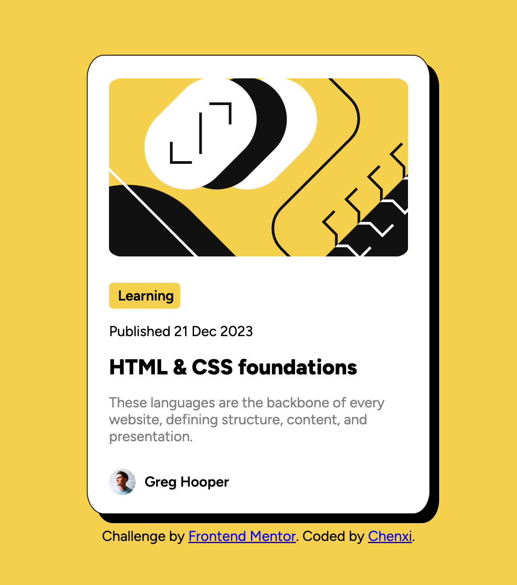

# Frontend Mentor - Blog preview card solution

This is a solution to the [Blog preview card challenge on Frontend Mentor](https://www.frontendmentor.io/challenges/blog-preview-card-ckPaj01IcS). Frontend Mentor challenges help you improve your coding skills by building realistic projects. 

## Table of contents

- [Overview](#overview)
  - [The challenge](#the-challenge)
  - [Screenshot](#screenshot)
  - [Links](#links)
- [My process](#my-process)
  - [Built with](#built-with)
  - [What I learned](#what-i-learned)
  - [Continued development](#continued-development)
  - [Useful resources](#useful-resources)
- [Author](#author)


## Overview

### The challenge

Users should be able to:

- See hover and focus states for all interactive elements on the page

### Screenshot




### Links

- Solution URL: [Github code](https://github.com/Chenxi96/blog-preview-card)
- Live Site URL: [Project site](https://singular-cupcake-16e900.netlify.app/)

## My process

### Built with

- HTML
- CSS
- Flexbox


### What I learned

In this project I learned how to add a shadow to the div and have a pointer when hovered over the h2 html tag.

To see how you can add code snippets, see below:

```html
<div class='cotainer'>
  <div class="container">
    <div class="image-container">
      
    </div>
    <div class="description-container">
      <div class="label">Learning</div>
      <p>Published 21 Dec 2023</p>
      <h2>HTML & CSS foundations</h2>
      <p class="paragraph">These languages are the backbone of every website, defining structure, content, and presentation.</p>
      <div class="author-container">
        
        <p class="name">Greg Hooper</p>
      </div>
    </div>
</div>
```

```css
.container {
    display: flex;
    flex-direction: column;
    align-items: center;
    width: 24rem;
    background-color: hsl(0, 0%, 100%);
    border-radius: 5%;
    border: solid 1px hsl(0, 0%, 7%);
    box-shadow: 10px 10px;
}

h2:hover {
    color: hsl(47, 88%, 63%);
    cursor: pointer;
}
```

### Continued development

I would like to get into the responsiveness of site, and get into making animations on the projects.

### Useful resources

- [Center a Div](https://www.w3schools.com/css/css_align.asp) - This helped me center a div.
- [FlexBox](https://css-tricks.com/snippets/css/a-guide-to-flexbox/) - This is a great site which help me use flexbox.


## Author

- Website - [Chenxi](my-portfolio-vert-xi-14.vercel.app)
- Frontend Mentor - [@Chenxi96](https://www.frontendmentor.io/profile/yourusername)
- Twitter - [@Chenxi_Lin_](https://www.twitter.com/Chenxi_Lin_)